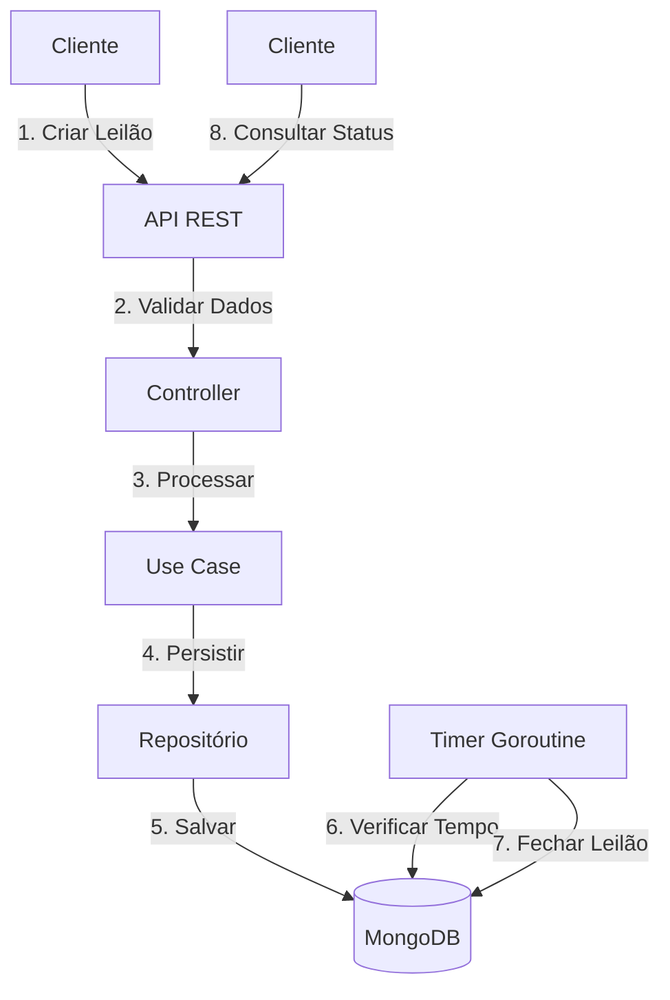
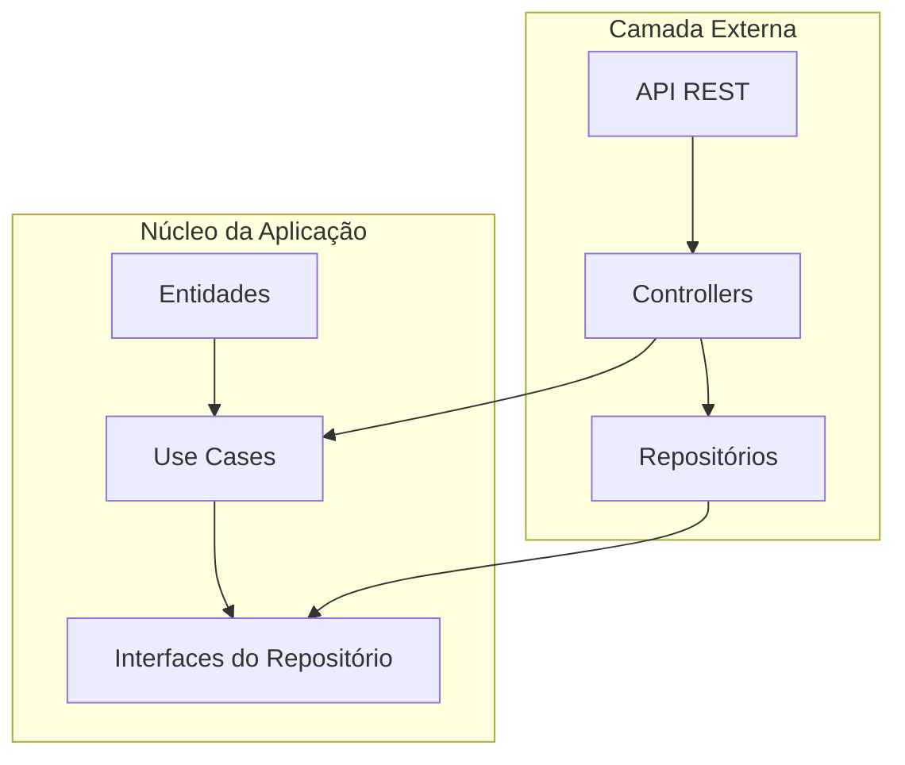

# GoExpert Auction Timer ⏳

Projeto do laboratório **"Concorrência com Golang - Leilão"** do treinamento GoExpert (FullCycle). O objetivo deste projeto é adicionar uma nova funcionalidade para que o leilão seja fechado automaticamente após um tempo definido, utilizando **goroutines** para gerenciamento concorrente. Desenvolvido por **Paulo Nunes**.

---

## 🏆 O Desafio

Adicionar uma funcionalidade ao projeto existente para fechamento automático de leilões após um tempo definido.  

### Contexto:
- A rotina de criação de leilão e lances já está implementada.
- O [projeto original](https://github.com/devfullcycle/labs-auction-goexpert) necessita de melhoria para incluir essa funcionalidade.
- A validação de leilão fechado ou aberto durante a criação de novos lances (bids) já está implementada.

---

## 🚀 Funcionalidades

- **Criação de leilão com duração automática:**  
  Configuração do tempo limite do leilão utilizando variáveis de ambiente.
- **Rotina de fechamento automático:**  
  Monitoramento e atualização dos leilões vencidos através de uma goroutine.
- **Testes automatizados:**  
  Cobertura de testes para garantir o correto funcionamento do fechamento automático.

---

## Configuração e Execução ⚙️

### 1. Configurar o Tempo de Fechamento 🕒
No arquivo `.env`, ajuste o valor do campo `AUCTION_DURATION` para definir o tempo que um leilão permanecerá ativo antes de ser fechado automaticamente.

### 2. Iniciar os Serviços 🚀
Execute o comando abaixo para iniciar a aplicação:
```bash
make up
```
Aguarde até que todos os serviços estejam completamente inicializados.

---

## Testando o Fechamento Automático ✅

### 1. Criar um Novo Leilão 🛒
Use o comando abaixo para criar um leilão utilizando um exemplo de requisição POST:
```bash
sudo make create
```

### 2. Listar Leilões Ativos 📋
Use o comando abaixo para listar os leilões com o status ativo (status = 0):
```bash
sudo make list
```
O campo status dos leilões retornados será 0, indicando que estão ativos.

### 3. Verificar o Fechamento 🔐
Aguarde o tempo configurado em `AUCTION_DURATION` no `.env`. Após o período, use o comando abaixo para verificar os leilões fechados:
```bash
sudo make check
```
Agora, o campo status dos leilões será 1, indicando que foram fechados automaticamente.

---

## Rodar os Testes Automatizados 🧪
Para executar os testes do projeto e verificar o comportamento do fechamento automático, use o comando:
```bash
sudo make test
```
---

## Outros Comandos Úteis 🛠️

### Derrubar os Contêineres ⬇️
```bash
make down
```

### Limpar Contêineres, Imagens e Volumes 🧹
Use o comando abaixo para remover todos os contêineres, imagens e volumes não utilizados, além de limpar o sistema:
```bash
make clear
```

### Executar Tudo em Sequência ⚙️
Para rodar toda a sequência de comandos (clear, up, create, list, check, test), use:
```bash
make all
```

---

## Arquitetura e Fluxo do Sistema 🏗️

### Fluxo do Sistema


### Arquitetura Clean


## Estrutura do Projeto 📂

```
.
├── api
│   └── api.http
├── cmd
│   └── auction
│       └── main.go
├── configuration
│   ├── database
│   │   └── mongodb
│   │       └── connection.go
│   ├── logger
│   │   └── logger.go
│   └── rest_err
│       └── rest_err.go
├── docker-compose.yml
├── Dockerfile
├── go.mod
├── go.sum
├── internal
│   ├── entity
│   │   ├── auction_entity
│   │   │   └── auction_entity.go
│   │   ├── bid_entity
│   │   │   └── bid_entity.go
│   │   └── user_entity
│   │       └── user_entity.go
│   ├── infra
│   │   ├── api
│   │   │   └── web
│   │   │       ├── controller
│   │   │       │   ├── auction_controller
│   │   │       │   │   ├── create_auction_controller.go
│   │   │       │   │   └── find_auction_controller.go
│   │   │       │   ├── bid_controller
│   │   │       │   │   ├── create_bid_controller.go
│   │   │       │   │   └── find_bid_controller.go
│   │   │       │   └── user_controller
│   │   │       │       └── find_user_controller.go
│   │   │       └── validation
│   │   │           └── validation.go
│   │   └── database
│   │       ├── auction
│   │       │   ├── create_auction.go
│   │       │   ├── create_auction_test.go
│   │       │   └── find_auction.go
│   │       ├── bid
│   │       │   ├── create_bid.go
│   │       │   └── find_bid.go
│   │       └── user
│   │           └── find_user.go
│   ├── internal_error
│   │   └── internal_error.go
│   └── usecase
│       ├── auction_usecase
│       │   ├── create_auction_usecase.go
│       │   └── find_auction_usecase.go
│       ├── bid_usecase
│       │   ├── create_bid_usecase.go
│       │   └── find_bid_usecase.go
│       └── user_usecase
│           └── find_user_usecase.go
├── Makefile
└── README.md
```